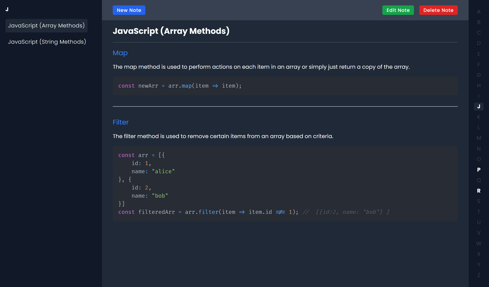

### Notes App

This app is a simple notes app that allows you to create, edit, and delete notes. It's built with Next JS, Redux Toolkit.

[Live App](https://alpha-notes.vercel.app/)

- Uses Markdown for formatting.
- Notes are stored in local storage via redux persist
- Notes are stored alphabetically by title.

TODO:

Hook up database

